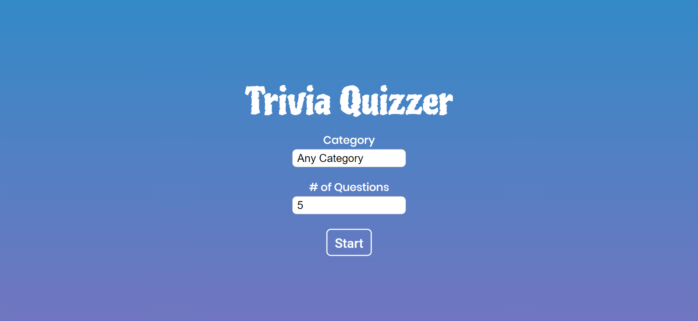
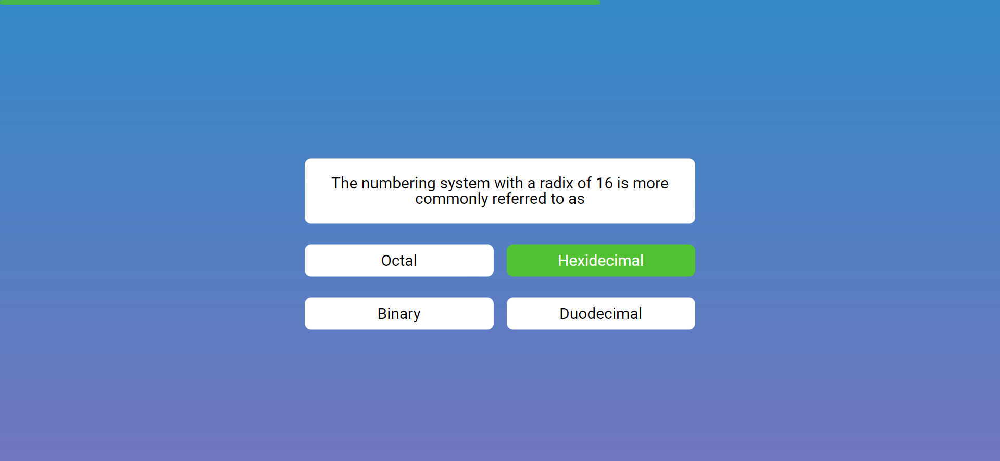

# Trivia Quizzer

A quiz application built with React and using [Open Trivia Database](https://opentdb.com/api_config.php) API.

## Overview - [Demo](https://trivia-quizzer.netlify.app/)
 ### Preview

 <p align="center">
  
</p>

<p align="center">
  
</p>

## Getting Started

### Requirements

- Node.js
- NPM

### Build/Run

```javascript
//Install dependencies
yarn

//Run app in dev
yarn start

//Build Prod
yarn build
```